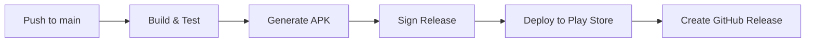

# DoTrack

<div align="center"> 
<meta property="twitter:image" content="https://github.com/shreyashp47/DoTrack/blob/main/SS/coverimage.png">

 
**A modern task management application that transforms your device wallpaper into a dynamic task list**

[](https://android.com)
[](https://android-arsenal.com/api?level=26)
[](https://kotlinlang.org)
[](LICENSE)
[](https://github.com/shreyashp47/DoTrack/actions)

[Download APK](https://github.com/shreyashp47/DoTrack/releases) • [Documentation](docs/) • [Report Bug](https://github.com/shreyashp47/DoTrack/issues) • [Request Feature](https://github.com/shreyashp47/DoTrack/issues)

</div>

---

## Features

<table>
<tr>
<td width="50%">

### **Task Management**
- Create, edit, complete, and delete tasks
- Priority levels (High, Medium, Low)
- Due dates and time tracking
- Category organization
- Smart reminder notifications

</td>
<td width="50%">

### **Dynamic Wallpaper**
- Auto-update device wallpaper with tasks
- Customizable color themes
- Adaptive text colors for readability
- Real-time wallpaper sync
- Manual sync control

</td>
</tr>
</table>

---

## Screenshots

<div align="center">
<table>
  <tr>
    <td align="center">
      
      <br><b>Tasks Overview</b>
    </td>
    <td align="center">
      
      <br><b>Add/Edit Task</b>
    </td>
    <td align="center">
      
      <br><b>Settings</b>
    </td>
    <td align="center">
      
      <br><b>Dynamic Wallpaper</b>
    </td>
  </tr>
</table>
</div>

---

## Quick Start

### Prerequisites

- **Android Studio**: Meerkat | 2024.3.1 or newer
- **JDK**: 11 or higher
- **Android SDK**: API 35
- **Minimum Android**: API 26 (Android 8.0)

### Installation

1. **Clone the repository**
   ```bash
   git clone https://github.com/shreyashp47/DoTrack.git
   cd DoTrack
   ```

2. **Open in Android Studio**
   ```bash
   # Open Android Studio and select "Open an existing project"
   # Navigate to the cloned directory
   ```

3. **Sync and Build**
   ```bash
   # In Android Studio:
   # 1. Sync Gradle files
   # 2. Build → Make Project
   # 3. Run on emulator or device
   ```

### Download APK

Get the latest release from our [Releases page](https://github.com/shreyashp47/DoTrack/releases)

---

## Architecture

DoTrack follows **Clean Architecture** principles with a multi-module approach:

```
DoTrack
├── app/                    # Presentation Layer
│   ├── ui/                 # Compose UI Components
│   ├── navigation/         # Navigation Logic
│   └── workmanager/        # Background Tasks
├── domain/                 # Business Logic Layer
│   ├── model/              # Domain Models
│   ├── repository/         # Repository Interfaces
│   └── usecase/            # Business Use Cases
├── data/                   # Data Layer
│   ├── local/              # Room Database
│   ├── repository/         # Repository Implementations
│   └── di/                 # Dependency Injection
└── core/                   # Shared Components
    ├── ui/                 # Common UI Components
    └── util/               # Utilities
```

### Tech Stack

<table>
<tr>
<td><b>Architecture</b></td>
<td>MVVM + Clean Architecture</td>
</tr>
<tr>
<td><b>UI Framework</b></td>
<td>Jetpack Compose + Material 3</td>
</tr>
<tr>
<td><b>Dependency Injection</b></td>
<td>Hilt</td>
</tr>
<tr>
<td><b>Navigation</b></td>
<td>Compose Navigation</td>
</tr>
<tr>
<td><b>Database</b></td>
<td>Room</td>
</tr>
<tr>
<td><b>Preferences</b></td>
<td>DataStore</td>
</tr>
<tr>
<td><b>Concurrency</b></td>
<td>Kotlin Coroutines + Flow</td>
</tr>
<tr>
<td><b>Background Tasks</b></td>
<td>WorkManager</td>
</tr>
<tr>
<td><b>Testing</b></td>
<td>JUnit, MockK, Espresso</td>
</tr>
</table>

---

## How to Use

### Creating Your First Task

1. **Open DoTrack** and tap the **Add** button
2. **Fill in task details**:
   - **Title**: What needs to be done?
   - **Description**: Additional details (optional)
   - **Priority**: High, Medium, or Low
   - **Due Date**: Set a deadline
   - **Reminder**: Get notified before due time
   - **Category**: Organize your tasks

3. **Save** and watch it appear on your task list!

### Managing Tasks

| Action | How To |
|--------|--------|
| **Complete Task** | Tap the checkbox |
| **Edit Task** | Tap on task → Edit icon |
| **Delete Task** | Task details → Delete icon |
| **View Details** | Tap on any task |

### Customizing Your Experience

#### Dynamic Wallpaper Setup
1. Go to **Settings**
2. Enable **"Auto Wallpaper Updates"**
3. Choose your **"Wallpaper Color"**
4. Grant wallpaper permission when prompted
5. Your tasks will now appear on your home screen!

#### Personalizing Colors
- **Wallpaper Background**: Settings → Wallpaper Color
- **Priority Colors**: Settings → Task Priority Colors
- **Categories**: Categories screen → Create custom categories

### Setting Up Reminders

1. **Enable notifications** in Settings
2. When creating/editing tasks, toggle **"Enable Reminder"**
3. Set a **due date and time**
4. Get notified **30 minutes before** the deadline

---

## Project Structure

<details>
<summary><b>Detailed File Structure</b></summary>

```
DoTrack/
├── app/src/main/java/com/shreyash/dotrack/
│   ├── ui/
│   │   ├── tasks/
│   │   │   ├── TasksScreen.kt
│   │   │   ├── TasksViewModel.kt
│   │   │   ├── TaskDetailScreen.kt
│   │   │   └── addedit/
│   │   │       ├── AddEditTaskScreen.kt
│   │   │       └── AddEditTaskViewModel.kt
│   │   ├── categories/
│   │   │   ├── CategoriesScreen.kt
│   │   │   └── CategoriesViewModel.kt
│   │   └── settings/
│   │       ├── SettingsScreen.kt
│   │       └── SettingsViewModel.kt
│   ├── navigation/
│   │   ├── DoTrackNavHost.kt
│   │   ├── DoTrackDestinations.kt
│   │   └── DoTrackBottomNavigation.kt
│   ├── workmanager/
│   │   ├── ReminderSchedulerImpl.kt
│   │   └── ReminderModule.kt
│   ├── core/util/
│   │   └── WallpaperGenerator.kt
│   ├── DoTrackApplication.kt
│   └── MainActivity.kt
│
├── domain/src/main/java/com/shreyash/dotrack/domain/
│   ├── model/
│   │   ├── Task.kt
│   │   └── Category.kt
│   ├── repository/
│   │   ├── TaskRepository.kt
│   │   ├── CategoryRepository.kt
│   │   └── UserPreferencesRepository.kt
│   └── usecase/
│       ├── task/
│       │   ├── AddTaskUseCase.kt
│       │   ├── GetTasksUseCase.kt
│       │   ├── UpdateTaskUseCase.kt
│       │   └── DeleteTaskUseCase.kt
│       ├── category/
│       │   └── [Category Use Cases]
│       └── preferences/
│           └── [Preference Use Cases]
│
├── data/src/main/java/com/shreyash/dotrack/data/
│   ├── local/
│   │   ├── entity/
│   │   │   ├── TaskEntity.kt
│   │   │   └── CategoryEntity.kt
│   │   ├── dao/
│   │   │   ├── TaskDao.kt
│   │   │   └── CategoryDao.kt
│   │   └── TaskDatabase.kt
│   ├── repository/
│   │   ├── TaskRepositoryImpl.kt
│   │   ├── CategoryRepositoryImpl.kt
│   │   └── UserPreferencesRepositoryImpl.kt
│   └── di/
│       ├── DatabaseModule.kt
│       ├── RepositoryModule.kt
│       └── DataStoreModule.kt
│
└── core/src/main/java/com/shreyash/dotrack/core/
    ├── ui/
    │   ├── components/
    │   │   └── LoadingIndicator.kt
    │   └── theme/
    │       ├── Color.kt
    │       ├── Theme.kt
    │       └── Type.kt
    └── util/
        └── Result.kt
```

</details>

---

## CI/CD Pipeline

DoTrack uses **GitHub Actions** for automated deployment:



### Pipeline Features
- **Automated Builds** on every PR and push
- **Version Management** with auto-increment
- **Release Management** with signed APKs
- **Google Play Deployment** (Internal Testing & Production)
- **GitHub Releases** with changelog

---

## Testing

### Running Tests

```bash
# Unit Tests
./gradlew test

# Instrumented Tests
./gradlew connectedAndroidTest

# All Tests
./gradlew check
```

### Test Coverage

- **Unit Tests**: Domain layer business logic
- **Integration Tests**: Repository implementations
- **UI Tests**: Compose UI components
- **End-to-End Tests**: Complete user workflows

---

## Contributing

We welcome contributions! Please see our [Contributing Guidelines](CONTRIBUTING.md) for details.

### Development Workflow

1. **Fork** the repository
2. **Create** a feature branch (`git checkout -b feature/amazing-feature`)
3. **Commit** your changes (`git commit -m 'Add amazing feature'`)
4. **Push** to the branch (`git push origin feature/amazing-feature`)
5. **Open** a Pull Request

### Code Style

- Follow [Kotlin Coding Conventions](https://kotlinlang.org/docs/coding-conventions.html)
- Use [ktlint](https://ktlint.github.io/) for formatting
- Write meaningful commit messages
- Add tests for new features

---

## Documentation

| Document | Description |
|----------|-------------|
| [User Guide](docs/USER_GUIDE.md) | Complete user manual |
| [Developer Guide](docs/DEVELOPER_GUIDE.md) | Development setup and guidelines |
| [API Documentation](docs/DOCUMENTATION.md) | Code documentation |
| [Workflow Guide](docs/WORKFLOW.md) | CI/CD and release process |

---

## License

This project is licensed under the MIT License - see the [LICENSE](LICENSE) file for details.

---

## 🙏 Acknowledgments

- **Material Design 3** for the beautiful UI components
- **Android Jetpack** for the robust architecture components
- **Kotlin Coroutines** for seamless asynchronous programming
- **Open Source Community** for the amazing libraries and tools

---

## 📞 Support & Contact

<div align="center">

**Need help or have suggestions?**

[](shreyashp47@gmail.com)
[](https://github.com/shreyashp47/DoTrack/issues)
[](https://www.linkedin.com/in/shreyashpattewardeveloper/)

**⭐ Star this repo if you find it helpful!**

</div>

---

<div align="center">

**Made with ❤️ by [Shreyash](https://github.com/shreyashp47)**

*DoTrack - Transform your productivity, one task at a time* ✨

</div>
